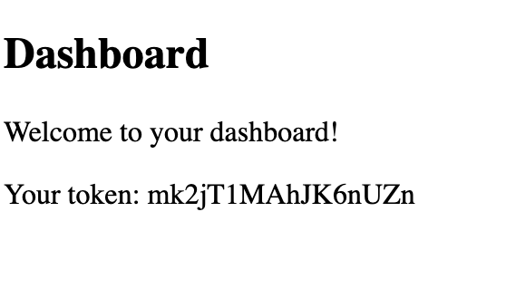

Login React APP
----------------------------
Simple React Login App using Webpack


Running App in local
----------------------------

Using npm:

```npm install```

```npm run start```

Using yarn:

```yarn install```

```yarn start```


Application URL:
----------------------------

http://localhost:8080


Configuring API URL:
---------------------

API URL is defined in the file:

```src/hooks/useLogin.ts```

Default API URL is:  

```http://localhost:8000/api/login```


Screenshots:
-------------
Login Page


Dashboard




